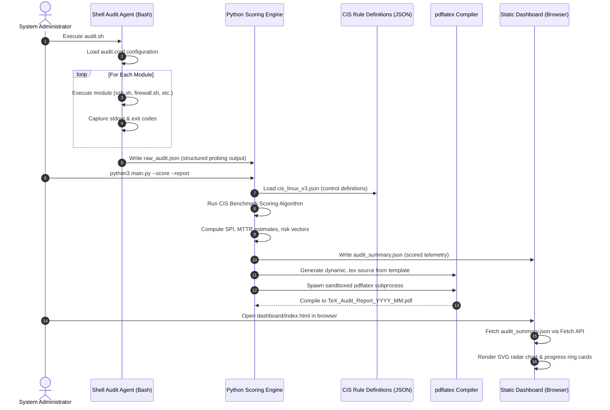

# TeX ⚔️
> **Zero-Dependency Security Compliance Auditor & Hardening Report Generator**

[](#)
[](https://www.python.org/)
[](https://www.gnu.org/software/bash/)
[](https://www.typescriptlang.org/)
[](#)

**TeX** is an enterprise-grade, zero-dependency Linux security compliance auditor. It automatically inspects hundreds of system configuration points across SSH, PAM, firewall rules, kernel parameters, filesystem permissions, and user policies — scoring each against the **CIS Benchmark for Linux** standard. Results are visualized in a premium zero-dependency web cockpit and compiled into print-ready PDF compliance reports via LaTeX.

---

## ⚡ Why TeX?

Modern security auditing tools (like Lynis, OpenSCAP, or cloud-based SIEM platforms) introduce heavy dependencies, require root-level privileges to install packages, or send data to external servers. **TeX is built differently:**

```
+----------------------------+       +----------------------------+
|   Traditional Audit Tools  |       |         TeX Platform       |
+----------------------------+       +----------------------------+
| • Requires package install |       | • Zero packages required   |
| • External cloud reporting |       | • 100% local & offline     |
| • Root/sudo to run agents  |       | • Runs as standard user    |
| • No PDF report output     |       | • LaTeX PDF report output  |
| • Node.js / Java runtimes  |       | • No runtime dependencies  |
+----------------------------+       +----------------------------+
```

---

## 🚀 Key Features

### 🔍 Modular Shell Audit Engine
A hierarchically structured audit framework that tests individual security domains through dedicated Bash modules:

| Module | Checks Performed |
|--------|-----------------|
| `ssh.sh` | Protocol version, `PermitRootLogin`, `PasswordAuthentication`, idle timeout, allowed users, MaxAuthTries |
| `firewall.sh` | Active ruleset presence, default deny policies, INPUT/OUTPUT/FORWARD chain analysis |
| `pam.sh` | Password complexity requirements, account lockout policy, multi-factor authentication presence |
| `sudoers.sh` | NOPASSWD entries, wildcard command grants, group-based privilege escalation |
| `filesystem.sh` | SUID/SGID binary enumeration, world-writable directories, sticky bit validation |
| `kernel.sh` | `sysctl` hardening params: ASLR, SYN cookies, IP forwarding, core dumps |
| `users.sh` | Accounts without passwords, UID 0 duplicates, inactive accounts, empty password fields |
| `services.sh` | Unnecessary network-facing services, insecure protocol daemons (`telnet`, `ftp`, `rsh`) |

### 🧠 CIS Benchmark Scoring Engine (Python)
- Compares raw audit output against 100+ machine-readable CIS control definitions.
- Calculates a per-category **Risk Score** (0–100) and a global **Security Posture Index (SPI)**.
- Classifies findings into severity tiers: `CRITICAL`, `HIGH`, `MEDIUM`, `LOW`, `PASS`.

### 🔷 TypeScript Rule Engine (Client-Side, No Node.js Runtime)
- Compiled from TypeScript to a single Vanilla JS bundle for browser use.
- Type-safe parsing, filtering, and grouping of audit JSON payloads.
- Zero NPM packages imported at runtime — output is pure ES6 JavaScript.

### 🌐 Premium Zero-Dependency Dashboard
- Dark-mode cockpit built with semantic HTML5 and custom CSS variables.
- **SVG Radar Chart**: Six-axis security domain visualization rendered without canvas libraries.
- **Progress Ring Cards**: Per-category score rings using SVG `stroke-dasharray` math.
- **Interactive Findings Table**: Client-side filtering by severity with live search.

### 📄 LaTeX PDF Compliance Report
- Dynamically compiled from a structured LaTeX template.
- Contains: Executive summary, per-category score table, full findings list, CVSS-style severity mapping, remediation recommendations, and an auditor signature block.
- Runs `pdflatex` in a sandboxed subprocess with `--no-shell-escape` enforced.

---

## 🔄 Audit Execution Pipeline



---

## 🛠️ Prerequisites

| Dependency | Version | Purpose |
|-----------|---------|---------|
| Python | `3.8+` | Scoring engine & report compiler |
| Bash | `4.0+` | Audit agent & modules |
| TypeScript | `5.0+` | Rule engine (compile-time only) |
| pdflatex | TeX Live 2022+ | PDF report compilation |
| Modern Browser | Chrome/Firefox/Edge | Dashboard viewer |

> **Note**: TypeScript is only required at **build time** to compile `src/*.ts` to `app.js`. The dashboard runs as pure Vanilla JS in the browser — no Node.js or npm is required on the target server.

---

## 🏁 Quick Start

```bash
# 1. Clone repository
git clone https://github.com/your-username/TeX.git && cd TeX

# 2. Run the audit agent (no root required for most checks)
chmod +x agent/audit.sh && bash agent/audit.sh

# 3. Score results and generate report
python3 engine/main.py --score --report --output-dir ./reports

# 4. Serve the dashboard locally
python3 -m http.server 8080 --directory ./dashboard
# Open http://localhost:8080 in your browser
```
