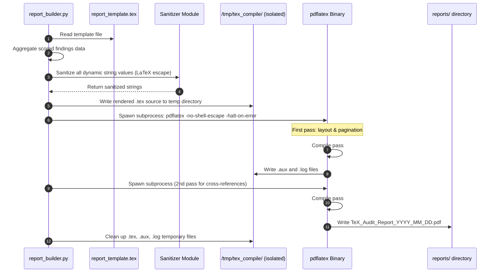

# 🏗️ System Architecture & Engineering Specifications
## TeX — Security Compliance Auditor

This document outlines the complete low-level and high-level system design of the **TeX** platform. It covers the audit execution pipeline, CIS Benchmark scoring algorithms, TypeScript rule engine mechanics, SVG radar chart mathematics, and LaTeX PDF compilation sandboxing.

---

## 1. Component Architecture Overview

```
+------------------------------------------------------------------------------------+
|                              TeX PLATFORM ARCHITECTURE                             |
+------------------------------------------------------------------------------------+
|                                                                                    |
|  LAYER 1: AUDIT COLLECTION                                                         |
|  +------------------+    +------------------+    +------------------+              |
|  |    ssh.sh        |    |   firewall.sh    |    |    kernel.sh     |  ...modules  |
|  | (CIS §5 checks)  |    | (CIS §3 checks)  |    | (CIS §3 checks)  |              |
|  +------------------+    +------------------+    +------------------+              |
|           |                      |                       |                         |
|           +----------------------+-----------------------+                         |
|                                  ↓                                                 |
|  LAYER 2: AGGREGATION                                                               |
|  +-------------------+                                                              |
|  |   audit.sh        |  (Orchestrates all modules → raw_audit.json)                |
|  +-------------------+                                                              |
|           ↓                                                                         |
|  LAYER 3: SCORING ENGINE                                                            |
|  +-------------------+    +-------------------+    +-------------------+           |
|  |   scorer.py       |    | cis_linux_v3.json |    |   validator.py   |           |
|  | (Risk calculation)|←→  | (Control defs)    |    | (Schema check)   |           |
|  +-------------------+    +-------------------+    +-------------------+           |
|           ↓                                                                         |
|  LAYER 4: OUTPUT                                                                    |
|  +-------------------+    +-------------------+                                    |
|  | report_builder.py |    |  audit_summary    |                                    |
|  | (PDF via LaTeX)   |    |  .json (Dashboard)|                                    |
|  +-------------------+    +-------------------+                                    |
|           ↓                       ↓                                                 |
|  LAYER 5: PRESENTATION                                                              |
|  +-------------------+    +-------------------+                                    |
|  | TeX_Report.pdf    |    |  index.html       |    (Zero-dependency browser UI)    |
|  | (LaTeX compiled)  |    |  + app.js (from TS)|                                   |
|  +-------------------+    +-------------------+                                    |
+------------------------------------------------------------------------------------+
```

---

## 2. Audit Module Execution & Output Model

The Shell audit layer is structured as a **modular probe system**. Each module (`ssh.sh`, `firewall.sh`, etc.) is an independent, stateless probe responsible for one security domain. The master orchestrator `audit.sh` calls each module and collects their JSON outputs into a single aggregate file.

### Module Output Contract
Every module must write its result as a JSON object to `stdout`. The master script reads each module's stdout and assembles the aggregate `raw_audit.json`:

```json
{
  "module": "ssh",
  "timestamp": 1749259200,
  "hostname": "prod-server-01",
  "checks": [
    {
      "cis_id": "5.2.1",
      "title": "Ensure SSH Protocol is set to 2",
      "status": "PASS",
      "actual_value": "Protocol 2",
      "expected_value": "Protocol 2",
      "severity": "HIGH",
      "remediation": "Set 'Protocol 2' in /etc/ssh/sshd_config"
    },
    {
      "cis_id": "5.2.8",
      "title": "Ensure SSH PermitRootLogin is disabled",
      "status": "FAIL",
      "actual_value": "PermitRootLogin yes",
      "expected_value": "PermitRootLogin no",
      "severity": "CRITICAL",
      "remediation": "Set 'PermitRootLogin no' in /etc/ssh/sshd_config and restart sshd"
    }
  ]
}
```

---

## 3. CIS Benchmark Scoring Algorithm

The Python `scorer.py` implements a **weighted risk scoring algorithm** derived from the CVSS v3.1 scoring model, adapted for configuration-based assessments.

### A. Per-Control Severity Weights

| Severity | Weight ($w$) | Criteria |
|----------|-------------|---------|
| `CRITICAL` | 10.0 | Allows immediate unauthorized root access or data exfiltration |
| `HIGH` | 7.5 | Significantly elevates attack surface or enables privilege escalation |
| `MEDIUM` | 5.0 | Introduces meaningful risk but requires additional conditions to exploit |
| `LOW` | 2.5 | Minor hardening gap with limited exploitability |
| `PASS` | 0.0 | Control satisfied; no deduction |

### B. Security Posture Index (SPI) Formula

Let $\Omega$ be the set of all CIS controls checked. Let $F \subseteq \Omega$ be the set of failed controls. The **Security Posture Index** is calculated as:

$$\text{SPI} = 100 \times \left(1 - \frac{\sum_{f \in F} w_f}{\sum_{c \in \Omega} w_c}\right)$$

Where:
- $w_f$ = weight of each failed control.
- $w_c$ = weight of each control (regardless of pass/fail status).
- SPI is clamped to the range $[0, 100]$.

### C. Category Score Formula

For each security domain category $k$ (e.g., SSH, Firewall, PAM), the **Category Risk Score** is:

$$\text{Score}_k = 100 \times \left(1 - \frac{\sum_{f \in F_k} w_f}{\sum_{c \in \Omega_k} w_c}\right)$$

These six category scores feed directly into the **SVG Radar Chart** rendered on the dashboard.

---

## 4. TypeScript Rule Engine Design

The TypeScript source compiles to a single `app.js` bundle with zero external npm dependencies at runtime. It implements a **type-safe client-side rule engine** that parses, validates, and renders the `audit_summary.json` file.

### Core Type Definitions (`types.ts`)
```typescript
export type Severity = 'CRITICAL' | 'HIGH' | 'MEDIUM' | 'LOW' | 'PASS';
export type CheckStatus = 'FAIL' | 'PASS';
export type ProbeModule = 'ssh' | 'firewall' | 'pam' | 'sudoers' | 'filesystem' | 'kernel';

export interface AuditCheck {
  cis_id: string;
  title: string;
  status: CheckStatus;
  actual_value: string;
  expected_value: string;
  severity: Severity;
  remediation: string;
}

export interface ModuleResult {
  module: ProbeModule;
  timestamp: number;
  hostname: string;
  checks: AuditCheck[];
}

export interface AuditSummary {
  generated_at: number;
  hostname: string;
  spi: number;
  category_scores: Record<ProbeModule, number>;
  findings_by_severity: Record<Severity, AuditCheck[]>;
  all_checks: AuditCheck[];
}
```

### Rule Engine Operations (`rule-engine.ts`)
The rule engine exposes a fluent filtering API compiled to Vanilla JS:
```typescript
export class RuleEngine {
  private checks: AuditCheck[];

  constructor(summary: AuditSummary) {
    this.checks = summary.all_checks;
  }

  filterBySeverity(severity: Severity): RuleEngine {
    this.checks = this.checks.filter(c => c.severity === severity);
    return this;
  }

  filterByStatus(status: CheckStatus): RuleEngine {
    this.checks = this.checks.filter(c => c.status === status);
    return this;
  }

  searchByTitle(keyword: string): RuleEngine {
    const q = keyword.toLowerCase();
    this.checks = this.checks.filter(c => c.title.toLowerCase().includes(q));
    return this;
  }

  getResults(): AuditCheck[] {
    return this.checks;
  }
}
```

---

## 5. SVG Radar Chart Mathematics

The security domain radar chart renders six axes representing the six audit domains. All calculations are performed in Vanilla JS (compiled from TypeScript) with no canvas or charting library dependencies.

### Coordinate Mapping
For a regular hexagon radar with $n = 6$ axes, center at $(C_x, C_y)$, and max radius $R$:

The angle for axis $i$ (where $i \in [0, 5]$) is:
$$\theta_i = \frac{2\pi \cdot i}{n} - \frac{\pi}{2}$$

For a score value $s_i \in [0, 100]$ on axis $i$, the SVG coordinate is:
$$x_i = C_x + R \cdot \frac{s_i}{100} \cdot \cos(\theta_i)$$
$$y_i = C_y + R \cdot \frac{s_i}{100} \cdot \sin(\theta_i)$$

The polygon's `points` attribute is built by joining all $(x_i, y_i)$ pairs as a space-separated string.

### SVG Structure
```xml
<svg viewBox="0 0 400 400" class="radar-chart">
  <!-- Background grid circles -->
  <circle cx="200" cy="200" r="160" fill="none" stroke="rgba(255,255,255,0.05)"/>
  <circle cx="200" cy="200" r="120" fill="none" stroke="rgba(255,255,255,0.05)"/>
  <circle cx="200" cy="200" r="80" fill="none" stroke="rgba(255,255,255,0.05)"/>
  <circle cx="200" cy="200" r="40" fill="none" stroke="rgba(255,255,255,0.05)"/>
  <!-- Axis lines (computed from theta_i) -->
  <line x1="200" y1="200" x2="200" y2="40" stroke="rgba(255,255,255,0.1)"/>
  <!-- Score polygon (dynamically computed) -->
  <polygon points="200,62 332,131 332,269 200,338 68,269 68,131"
           fill="rgba(99, 102, 241, 0.35)"
           stroke="#6366f1"
           stroke-width="2"/>
</svg>
```

---

## 6. LaTeX PDF Compilation Pipeline



### Two-Pass Compilation Rationale
LaTeX requires two compilation passes because the first pass discovers all `\label{}` and `\ref{}` markers, writing them to an `.aux` file. The second pass reads this `.aux` file to resolve page references in the table of contents and cross-references inside the report body. Skipping the second pass produces a report with `??` placeholders for page numbers.
