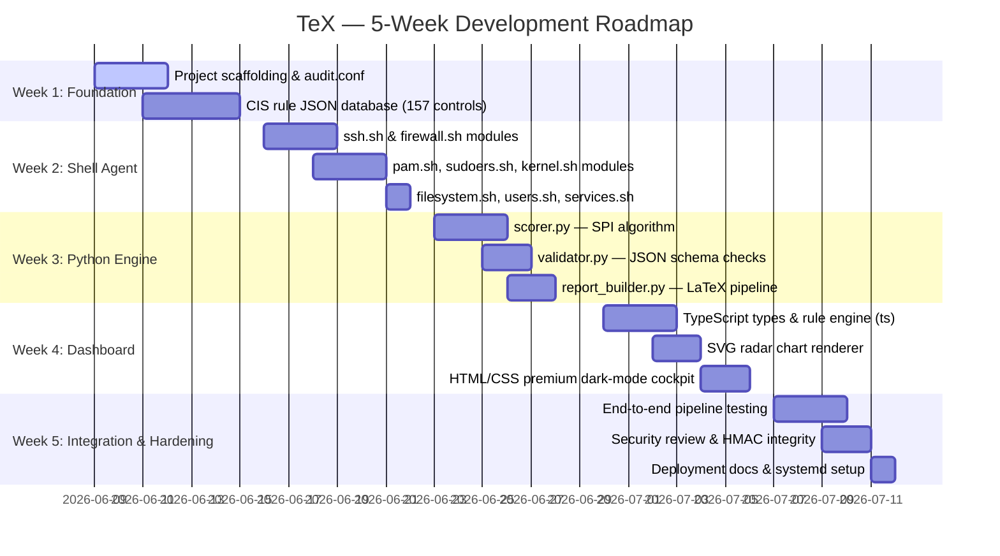

# 📅 Development Roadmap & Execution Timeline
## TeX — Security Compliance Auditor

**Version**: 1.0  
**Date**: 07 June 2026  
**Status**: Roadmap Approved  

---

## 1. Project Execution Timeline

---

## 2. Phase-by-Phase Task Checklists

### 🏗️ Week 1: Project Foundation & CIS Rule Database

**Goal**: Establish the project skeleton and the machine-readable rule database that drives all subsequent scoring logic.

- [ ] Initialize Git repository with `.gitignore` excluding `data/` and `reports/`.
- [ ] Create the complete directory structure as documented in `PSD.md`.
- [ ] Write `agent/audit.conf` with all module toggles and configuration keys.
- [ ] Write `agent/audit.sh` master orchestrator: config parser, module runner, JSON assembler.
- [ ] Implement HMAC-SHA256 integrity signing in `audit.sh`.
- [ ] Write `rules/cis_linux_v3.json` with all 157 CIS Level 1 control definitions for:
  - Section 2: Services (18 controls)
  - Section 3: Network (26 controls)
  - Section 4: Logging (31 controls)
  - Section 5: Access Control (41 controls)
  - Section 6: Maintenance (19 controls)
- [ ] Validate JSON file with a schema linter.

---

### 🔍 Week 2: Shell Audit Modules (All 8 Modules)

**Goal**: Build all eight modular audit probe scripts, each producing validated JSON output.

- [ ] **`ssh.sh`**: Implement all 12 CIS SSH checks:
  - [ ] `5.2.1` SSH Protocol version
  - [ ] `5.2.4` SSH MaxAuthTries
  - [ ] `5.2.5` SSH IgnoreRhosts
  - [ ] `5.2.6` SSH HostbasedAuthentication
  - [ ] `5.2.8` SSH PermitRootLogin
  - [ ] `5.2.9` SSH PermitEmptyPasswords
  - [ ] `5.2.10` SSH PermitUserEnvironment
  - [ ] `5.2.12` SSH X11Forwarding
  - [ ] `5.2.13` SSH MaxStartups
  - [ ] `5.2.14` SSH MaxSessions
  - [ ] `5.2.15` SSH LoginGraceTime
  - [ ] `5.2.16` SSH Banner configured

- [ ] **`firewall.sh`**: UFW/iptables checks (8 controls).
- [ ] **`pam.sh`**: PAM stack password policy checks (14 controls).
- [ ] **`sudoers.sh`**: Privilege escalation configuration checks (7 controls).
- [ ] **`kernel.sh`**: sysctl hardening parameters (26 controls).
- [ ] **`filesystem.sh`**: SUID/SGID enumeration + world-writable checks (19 controls).
- [ ] **`users.sh`**: Account security checks (10 controls).
- [ ] **`services.sh`**: Unnecessary daemon detection (18 controls).
- [ ] Write BATS test stubs for all 157 controls (PASS and FAIL states).
- [ ] Run `shellcheck` on all scripts — zero warnings required.

---

### 🐍 Week 3: Python Scoring Engine & LaTeX Compiler

**Goal**: Build the intelligence layer that transforms raw audit output into scored findings and professional PDF reports.

- [ ] **`engine/scorer.py`**:
  - [ ] Implement `load_controls()` — JSON rule loader with schema validation.
  - [ ] Implement `map_findings()` — Map raw audit checks to CIS control definitions.
  - [ ] Implement `calculate_spi()` — Global Security Posture Index formula.
  - [ ] Implement `calculate_category_scores()` — Per-domain scores for radar chart.
  - [ ] Implement `classify_severity()` — Severity tier assignment.
  - [ ] Write `audit_summary.json` with 90-day history slot for future diff mode.
  
- [ ] **`engine/validator.py`**:
  - [ ] JSON Schema Draft-07 validation of `raw_audit.json` input.
  - [ ] JSON Schema Draft-07 validation of `audit_summary.json` output.
  - [ ] HMAC signature verification on input file.
  
- [ ] **`engine/report_builder.py`**:
  - [ ] Implement `escape_latex()` — Full character escape map.
  - [ ] Implement `render_template()` — Token replacement in `.tex` template.
  - [ ] Implement `compile_pdf()` — Two-pass `pdflatex` subprocess with timeout.
  - [ ] Implement `cleanup_artifacts()` — Remove `.aux`, `.log`, `.out` files.
  
- [ ] **`engine/templates/report_template.tex`**:
  - [ ] Design LaTeX preamble with `booktabs`, `fancyhdr`, `geometry`, `xcolor`.
  - [ ] Build executive summary section with SPI score gauge visual.
  - [ ] Build per-category score summary table.
  - [ ] Build full findings `longtable` with severity color coding.
  - [ ] Build remediation appendix section.
  - [ ] Build auditor signature and approval block.
  
- [ ] Run scoring math unit tests — 100% assertion pass rate.
- [ ] Run LaTeX fuzz corpus — zero compiler failures.

---

### 🌐 Week 4: TypeScript Rule Engine & Dashboard

**Goal**: Build the premium zero-dependency web cockpit with type-safe data handling.

- [ ] **TypeScript Source** (`dashboard/src/`):
  - [ ] Write `types.ts` — All shared interface and enum definitions.
  - [ ] Write `rule-engine.ts` — Fluent filter API (by severity, status, keyword).
  - [ ] Write `renderer.ts` — SVG radar chart coordinate math (six-axis polygon).
  - [ ] Write `renderer.ts` — SVG progress ring `stroke-dasharray` computation.
  - [ ] Write `main.ts` — Fetch API data loading + initialization.
  - [ ] Configure `tsconfig.json` for `"module": "None"` single-file output.
  - [ ] Compile TypeScript to `dashboard/app.js` — verify zero compile errors.
  
- [ ] **Dashboard UI** (`dashboard/`):
  - [ ] Build `index.html` with semantic HTML5 structure and unique element IDs.
  - [ ] Build `style.css` with dark-mode CSS custom properties (no Tailwind).
  - [ ] Implement progress ring cards for each of the six security domains.
  - [ ] Implement interactive findings table with live JavaScript filtering.
  - [ ] Implement SVG radar chart rendered from TypeScript-compiled code.
  - [ ] Validate page loads and renders in < 500ms from local filesystem.
  
- [ ] Cross-browser SVG validation on Chrome, Firefox, and Edge.

---

### ✅ Week 5: Integration Testing, Security Review & Deployment

**Goal**: End-to-end pipeline validation, security hardening, and production deployment preparation.

- [ ] Run full audit pipeline on a live test Ubuntu 22.04 VM.
- [ ] Verify `raw_audit.json` schema validation passes.
- [ ] Verify PDF compiles in < 10 seconds.
- [ ] Verify dashboard renders all 157 check results correctly.
- [ ] Execute LaTeX injection fuzz corpus — zero compile failures.
- [ ] Review all shell scripts with ShellCheck — zero warnings.
- [ ] Verify HMAC integrity rejection works when `raw_audit.json` is manually tampered.
- [ ] Write `systemd` service and timer unit files.
- [ ] Write Nginx virtual host configuration.
- [ ] Write `logrotate.d` configuration.
- [ ] Final documentation review — all `TEX-DOCS/` files up to date.

---

## 3. MVP Release Success Criteria

The MVP is declared successful when ALL of the following criteria are verified on a clean Ubuntu 22.04 LTS virtual machine:

| # | Criterion | Verification Method |
|---|-----------|-------------------|
| 1 | All 8 shell modules execute without errors | `bash agent/audit.sh; echo $?` returns `0` |
| 2 | `raw_audit.json` passes JSON Schema validation | `python3 engine/validator.py` exits `0` |
| 3 | SPI is calculated within ±0.01 of manual formula | Compare against spreadsheet calculation |
| 4 | PDF compiles in < 10 seconds | `time python3 engine/main.py --report` |
| 5 | Dashboard renders without console errors | Browser DevTools shows zero JS errors |
| 6 | LaTeX injection fuzz corpus passes | All 10 payloads compile without error |
| 7 | Tampered JSON is rejected with SecurityError | Manually edit `raw_audit.json`, rerun scorer |

---

## 4. Post-MVP Roadmap (Future Milestones)

| Feature | Estimated Effort | Value |
|---------|-----------------|-------|
| **Audit Diff Mode** — Compare two snapshots for drift detection | 1 week | HIGH |
| **Remediation Runbook Generator** — Auto-generate fix scripts | 2 weeks | HIGH |
| **NIST 800-53 Mapping Report** — Federal compliance overlay | 1 week | MEDIUM |
| **Remote Agent Mode** — SSH-based multi-server auditing | 3 weeks | MEDIUM |
| **Webhook Alerting** — Slack/Teams notification on CRITICAL findings | 1 week | MEDIUM |
| **CIS Level 2 Controls** — Expand from 157 to 250+ controls | 3 weeks | LOW |
